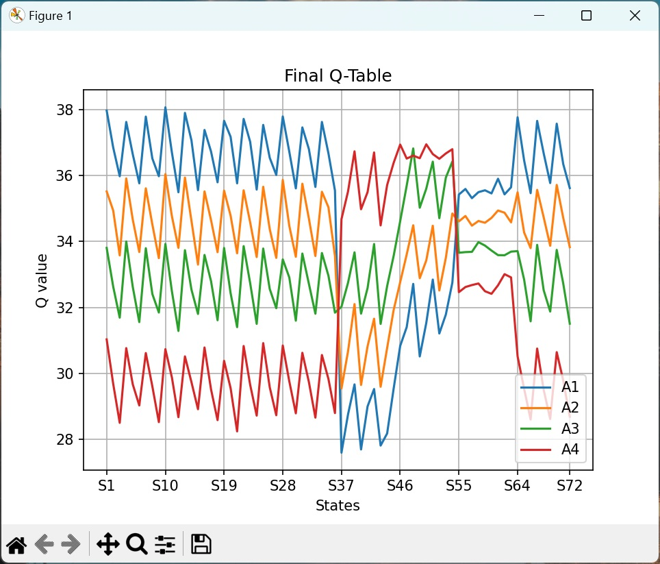
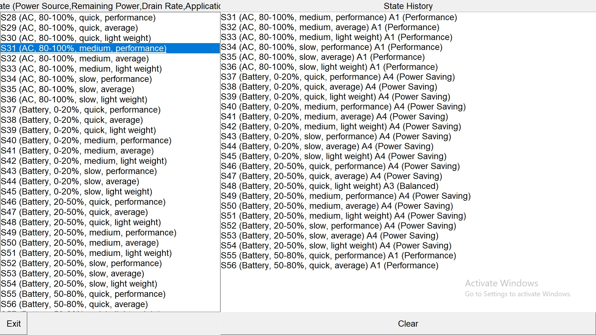

# QPC-1: Q-Learning Power Control

## Introduction
QPC-1 is a Q-Learning Power Control project designed to optimize power usage through Q-Learning algorithms.

## Installation

1. **Download and Install Git**
    - Download Git from [here](https://git-scm.com/download/win).

2. **Clone the Repository**
    - Open a command prompt and navigate to the folder where you want to clone the repository.
    - Execute the following command (you may be asked to sign in to GitHub):
    ```bash
    git clone https://github.com/paulchitw/QPC-1.git
    ```

3. **Navigate to the Project Directory**
    - Change to the QPC-1 directory:
    ```bash
    cd QPC-1
    ```

4. **Install Requirements**
    - Install the required Python packages:
    ```bash
    pip install -r requirements.txt
    ```

## Configuration

1. **Set Up Environment Variables**
    - Create a `.env` file in the root directory of the project.
    - Add your OpenAI API Key to the `.env` file:
    ```
    OPENAI_API_KEY=your_openai_api_key
    ```

## Running the Project
To execute the project, follow the steps below:

```bash
python main.py
```

Make sure to replace `your_openai_api_key` with your actual OpenAI API key.


## Running with .exe

If you have an executable version of the project, you can run it without needing to use the Python interpreter. Here are the steps:

1. **Navigate to the Project Directory**
    - Open a command prompt and navigate to the folder where your executable file is located.

2. **Run the Executable File**
    - Execute the following command:
    ```bash
    QPC-1.exe
    ```
You may refer to **"QPC-1 Usage.mp4"** which demonstrate the usage.

Image#1 Converged Q-table


Image#2 Simulator of States and Actions



